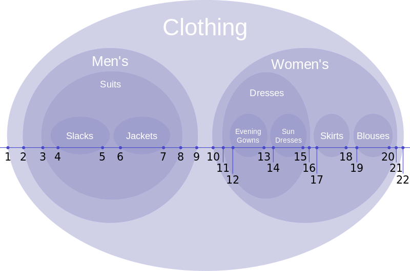
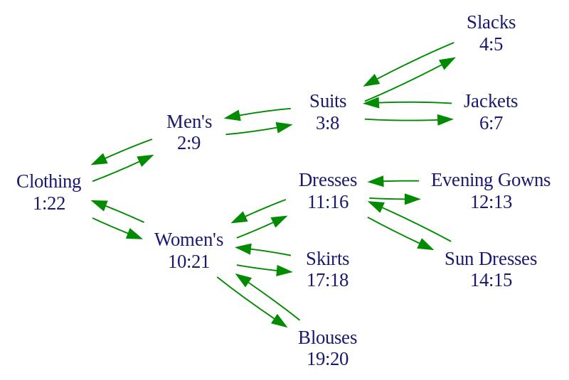

# **深入浅出 CRUD**
#### 我所理解的业务逻辑

Miclle Zheng
@miclle

-----------------------------------------------------------------------

# Create, Read, Update, and Delete (CRUD)

CRUD     | Databases (SQL)   | MongoDB  | RESTful APIs (HTTP)
:-------:|:-----------------:|:--------:|:--------------------:
Create   | INSERT            | Insert   | POST
Read     | SELECT            | Remove   | GET
Update   | UPDATE            | Find     | PUT / PATCH
Delete   | DELETE            | Update   | DELETE

-----------------------------------------------------------------------

# 来几道简单的面试题：

1. 删除数据用什么方法？
2. PUT *vs* PATCH
3. 200 *vs* 201 *vs* 204
4. 301 *vs* 302
5. 401 *vs* 403

-----------------------------------------------------------------------

# 初探业务系统：从一个 Blog 程序开始
### 文章（Article）模型分析：

<div>
  <div style="width: 50%; float: left">

  字段描述   | 字段名称           | 字段类型
  :-------:|:-----------------:|:--------------
  文章主键   | id               | integer
  文章标题   | title            | string
  文章内容   | content          | string
  创建时间   | created_at       | unix timestamp
  更新时间   | updated_at       | unix timestamp

  </div>
  <div style="width: 50%; float:right; margin-top: 15px">

  ```go
  // Article model
  type Article struct {
    ID        uint   `json:"id"         gorm:"primaryKey"`
    Title     string `json:"title"      gorm:"size:255"`
    Content   string `json:"content"    gorm:"size:1048576"`
    CreatedAt int64  `json:"created_at"`
    UpdatedAt int64  `json:"updated_at"`
  }
  ```

  </div>
</div>

-----------------------------------------------------------------------

### 功能分析

功能描述 | CRUD    | Database  | RESTful APIs (HTTP) | URL
:------:|:-------:|:---------:|:-------------------:|--------------
创建文章 | Create  | INSERT    | POST                | /articles
文章列表 | Read    | SELECT    | GET                 | /articles
文章详情 | Read    | SELECT    | GET                 | /articles/:id
更新文章 | Update  | UPDATE    | PUT / PATCH         | /articles/:id
删除文章 | Delete  | DELETE    | DELETE              | /articles/:id

-----------------------------------------------------------------------

### RESTful API

#### Create an article
```
POST /articles
```

###### Parameters
Name    | Type   | In    | Description
:------:|:------:|:-----:|------------
title   | string | body  | **Required**. The title of the article.
content | string | body  | **Required**. The contents of the article.

###### Code samples

```shell
curl \
  -X POST \
  -H 'Accept: application/json, text/plain, */*' \
  http://localhost:3000/articles \
  -d '{"title":"title", "content":"content"}'
```

```
Status: 201 Created
```

-----------------------------------------------------------------------

#### List articles
```
GET /articles
```

##### Parameters
Name     | Type    | In     | Description
:-------:|:-------:|:------:|------------
per_page | integer | query  | Results per page.
page     | integer | query  | Page number of the results to fetch.
q        | string  | query  |

###### Code samples

```shell
curl 'http://localhost:3000/articles' \
  -H 'Accept: application/json, text/plain, */*' \
```

-----------------------------------------------------------------------

###### Response
```
Status: 200 OK
```

<div>
  <div style="width: 48%; float: left; margin-right: 5px;">

  ```
  [
    {
      "id": 1,
      "title": "title",
      "content": "content",
      "created_at": 1627290338,
      "updated_at": 1627290338
    }
    ...
    ...
    ...
  ]
  ```

  </div>

  <div style="width:3%; float: left; margin-top: 100px; text-align: center;">

  *vs*

  </div>

  <div style="width: 48%; float:right; margin-left: 5px;">

  ```
  {
    items: [
      {
        "id": 1,
        "title": "title",
        "content": "content",
        "created_at": 1627290338,
        "updated_at": 1627290338
      }
      ...
    ]
  }
  ```

  </div>
</div>

-----------------------------------------------------------------------

#### Get an articles
```
GET /articles/:id
```

###### Code samples

```shell
curl 'http://localhost:3000/articles/1' \
  -H 'Accept: application/json, text/plain, */*' \
```

###### Response
```
Status: 200 OK
```

```
{
  "id": 1,
  "title": "title",
  "content": "content",
  "created_at": 1627290338,
  "updated_at": 1627290338
}
```

-----------------------------------------------------------------------
#### Update an article
```
PATCH /articles/:id
```

###### Parameters
Name    | Type    | In   | Description
:------:|:-------:|:----:|-----------------------------
id      | integer | path | The article id parameter
title   | string  | body | The title of the article.
content | string  | body | The contents of the article.

###### Code samples

```shell
curl 'http://localhost:3000/articles/1' \
  -X 'PATCH' \
  -H 'Accept: application/json, text/plain, */*' \
  -H 'Content-Type: application/json;charset=UTF-8' \
  --data-raw '{"title":"title", "content":"content"}' \
```

```
Status: 200 OK
```

-----------------------------------------------------------------------

#### Delete an article
```
DELETE /articles/:id
```

###### Parameters
Name    | Type    | In   | Description
:------:|:-------:|:----:|-----------------------------
id      | integer | path | The article id parameter
title   | string  | body | The title of the article.
content | string  | body | The contents of the article.

###### Code samples

```shell
curl 'http://localhost:3000/articles/1' \
  -X 'DELETE' \
```

```
Status: 204 No Content
```

-----------------------------------------------------------------------

# 多租户（有多个作者） Blog 怎么处理？

#### 加两个字段还是加个模型？

<div style="display: block; width: 100%; height: auto; overflow: hidden">
  <div style="width: 48%; float: left; margin-right: 5px;">

  ```go
  // Article model
  type Article struct {
    ID          uint   `json:"id"           gorm:"primaryKey"`
    Title       string `json:"title"        gorm:"size:255"`
    AuthorName  string `json:"author_name"  gorm:"size:255"`
    AuthorTitle string `json:"author_title" gorm:"size:255"`
    Summary     string `json:"summary"      gorm:"size:65535"`
    Content     string `json:"content"      gorm:"size:1048576"`
    CreatedAt   int64  `json:"created_at"`
    UpdatedAt   int64  `json:"updated_at"`
  }
  ```
  </div>

  <div style="width:3%; float: left; margin-top: 100px; text-align: center;">

  *vs*

  </div>

  <div style="width: 48%; float:right; margin-left: 5px;">

  ```go
  // User model
  type User struct {
    ID        uint   `json:"id"         gorm:"primaryKey"`
    Name      string `json:"name"       gorm:"size:255"`
    Title     string `json:"title"      gorm:"size:255"`
    Bio       string `json:"bio"        gorm:"size:65535"`
    CreatedAt int64  `json:"created_at"`
    UpdatedAt int64  `json:"updated_at"`
  }

  // Article model
  type Article struct {
    ID        uint   `json:"id"         gorm:"primaryKey"`
    UserID    uint   `json:"-"          gorm:"index"`
    Title     string `json:"title"      gorm:"size:255"`
    Summary   string `json:"summary"    gorm:"size:65535"`
    Content   string `json:"content"    gorm:"size:1048576"`
    CreatedAt int64  `json:"created_at"`
    UpdatedAt int64  `json:"updated_at"`

    Author *User `json:"author,omitempty" gorm:"foreignKey:UserID"`
  }
  ```

  </div>
</div>

-----------------------------------------------------------------------
# What is N+1 query?

#### List articles:

###### <span style="color:orange">Bad case</span>

```go
articles, err := database.Find(&articles)
// SELECT * FROM articles;

for article, _ := range article {
  article.Author, err := database.First(&article.UserID) // N+1 query
  // SELECT * FROM users WHERE id = ? LIMIT 1;
}
```

###### <span style="color:green">Good case</span>

```go
database.Preload("Author").Find(&articles)
```

<div style="display: block; width: 100%; height: auto; overflow: hidden">
  <div style="width: 48%; float: left; margin-right: 5px;">

  ```sql
  SELECT * FROM articles
  LEFT JOIN users ON users.id = articles.user_id;
  ```

  </div>

  <div style="width:3%; float: left; text-align: center;">

  *vs*

  </div>

  <div style="width: 48%; float:right; margin-left: 5px;">

  ```sql
  SELECT * FROM articles
  SELECT * FROM users WHERE id IN (...)
  ```

  </div>
</div>

-----------------------------------------------------------------------

#### List articles
```
GET /articles
```

###### Response

```
{
  items: [
    {
      "id": 1,
      "title": "title",
      "content": "content",
      "created_at": 1627290338,
      "updated_at": 1627290338,
      "author": {
        "id": "1",
        "name": "Author Name",
        "title": "Author Title",
        "created_at": 1627290338,
        "updated_at": 1627290338
      }
    }
    ...
  ]
}
```

-----------------------------------------------------------------------

#### 这样处理是不是也可以？有什么好处？

<div>
  <div style="width: 48%; float: left; margin-right: 5px;">

  ```go
  // Article model
  type Article struct {
    ID          uint   `json:"id"           gorm:"primaryKey"`
    UserID      uint   `json:"-"            gorm:"index"`
    Title       string `json:"title"        gorm:"size:255"`
    AuthorName  string `json:"author_name"  gorm:"size:255"`
    AuthorTitle string `json:"author_title" gorm:"size:255"`
    Summary     string `json:"summary"      gorm:"size:65535"`
    Content     string `json:"content"      gorm:"size:1048576"`
    CreatedAt   int64  `json:"created_at"`
    UpdatedAt   int64  `json:"updated_at"`

    Author *User `json:"author,omitempty" gorm:"foreignKey:UserID"`
  }
  ```

  </div>

  <div style="width: 48%; float:right; margin-left: 5px;">

  ```go
  // User model
  type User struct {
    ID        uint   `json:"id"         gorm:"primaryKey"`
    Name      string `json:"name"       gorm:"size:255"`
    Title     string `json:"title"      gorm:"size:255"`
    Bio       string `json:"bio"        gorm:"size:65535"`
    CreatedAt int64  `json:"created_at"`
    UpdatedAt int64  `json:"updated_at"`
  }
  ```

  </div>
</div>

-----------------------------------------------------------------------

# 给文章加点评论

### 评论（Comment）模型分析：

<div>
  <div style="width: 50%; float: left">

  字段描述   | 字段名称      | 字段类型
  :-------:|:------------:|:--------------
  评论主键   | id          | integer
  文章外键   | article_id  | integer
  评论人名称 | name        | string
  评论人邮箱 | email       | string
  评论内容   | content     | string
  创建时间   | created_at  | unix timestamp
  更新时间   | updated_at  | unix timestamp

  </div>
  <div style="width: 50%; float:right; margin-top: 15px">

  ```go
  // Comment model
  type Comment struct {
    ID        uint   `json:"id"         gorm:"primaryKey"`
    ArticleID uint   `json:"article_id" gorm:"index"`
    Name      string `json:"name"       gorm:"size:255"`
    Email     string `json:"email"       gorm:"size:255"`
    Content   string `json:"content"    gorm:"size:1048576"`
    CreatedAt int64  `json:"created_at"`
    UpdatedAt int64  `json:"updated_at"`
  }
  ```

  </div>
</div>

-----------------------------------------------------------------------

### 评论接口设计（RESTful）

功能描述 |  RESTful APIs (HTTP) | URL
:------:|:--------------------:|--------------
创建评论 |  POST                | /articles/:id/comments
评论列表 |  GET                 | /articles/:id/comments
更新评论 |  PUT / PATCH         | /articles/:id/comments/:comment_id
删除评论 |  DELETE              | /articles/:id/comments/:comment_id

-----------------------------------------------------------------------

# RESTful 架构风格下的常见安全问题

## 遗漏了对资源从属关系的检查
一个典型的 RESTful 的 URL 会用资源名加上资源的 ID 编号来标识其唯一性，就像这样 /articles/:id，/articles/:id/comments/:comment_id 例如：
`/articles/1`, `/articles/1/comments/123`

###### 创建文章评论
```go
comment := &Comment{ ... }
comment.ArticleID = 1
database.Create(comment)
// INSERT INTO `comments` (`article_id`,`name`,`email`,`content`,`created_at`) VALUES (1,"Name","email@domain.com","content...",1627290338);
```

###### 文章评论列表
```go
var comments []Comment
database.Where("article_id = ?", 1).Find(&comments)
// SELECT * FROM comments WHERE article_id = 1;
```

-----------------------------------------------------------------------

###### 更新文章评论

`/articles/1/comments/123`
`/articles/2/comments/456`

```go
// params binding...

var (
  articleID = params.Get("id")
  comment   = Comment{
    ID: params.Get("comment_id"),
  }
)
```

###### <span style="color:red">Big bug</span>

```go
database.Model(&comment).Update("content", "new content...")
// UPDATE comments SET content='new content...', updated_at=1627290338 WHERE id=123;
// maybe article_id = 2
```

###### <span style="color:green">Must limit</span>
```go
database.Model(&comment).Where("article_id = ?", articleID).Update("content", "new content...")
// UPDATE comments SET content='new content...', updated_at=1627290338 WHERE id=123 AND article_id = 1;
```

-----------------------------------------------------------------------

## 数字自增 ID 会泄露业务信息

`/articles/1`
`/articles/2`
`/articles/3`
`/articles/4`
...
`/articles/1/comments/1`
`/articles/1/comments/2`
...

资源 ID 是 RESTful URL 中很重要的一个组成部分，大多数情况下这类资源ID都是用数字来表示的。这在不经意间泄露了业务信息，而这些信息可能正是竞争对手希望得到的数据

解决办法是不使用按序递增的数字作为 ID，或使用具有随机性、唯一性、不可预测性的值作为 ID，如 UUID

-----------------------------------------------------------------------

## 其它安全问题，返回多余的数据

```
GET /articles
```

```go
database.Preload("Author").Find(&articles)
```

<div style="display: block; width: 100%; height: auto; overflow: hidden">
  <div style="width: 49%; float: left; margin-right: 5px;">

  ```go
  // User model
  type User struct {
    ID                uint   `json:"id"                 gorm:"primaryKey"`
    Name              string `json:"name"               gorm:"size:255"`
    Title             string `json:"title"              gorm:"size:255"`
    Bio               string `json:"bio"                gorm:"size:65535"`
    EncryptedPassword []byte `json:"encrypted_password" gorm:"default:NULL"`
    CreatedAt         int64  `json:"created_at"`
    UpdatedAt         int64  `json:"updated_at"`
  }

  // Article model
  type Article struct {
    ID        uint   `json:"id"         gorm:"primaryKey"`
    UserID    uint   `json:"-"          gorm:"index"`
    Title     string `json:"title"      gorm:"size:255"`
    Summary   string `json:"summary"    gorm:"size:65535"`
    Content   string `json:"content"    gorm:"size:1048576"`
    CreatedAt int64  `json:"created_at"`
    UpdatedAt int64  `json:"updated_at"`

    Author *User `json:"author,omitempty" gorm:"foreignKey:UserID"`
  }
  ```

  </div>

  <div style="width: 49%; float:right; margin-left: 5px;">

  ```
  {
    items: [
      {
        "id": 1,
        "title": "title",
        "content": "content",
        "created_at": 1627290338,
        "updated_at": 1627290338,
        "author": {
          "id": "1",
          "name": "Author Name",
          "title": "Author Title",
          "bio": "Author bio content"
          "encrypted_password": "$2a$10$Jpd.qN7rzAQHV8uv..."
          "created_at": 1627290338,
          "updated_at": 1627290338
        }
      }
      ...
    ]
  }
  ```

  </div>
</div>

-----------------------------------------------------------------------

###### <span style="color:green">Good case</span>

```go
database.Preload("Author", func(db *gorm.DB) *gorm.DB {
  return db.Select([]string{"name", "title"}) // Limit SQL query columns
}).Find(&articles)
```

```go
// User model
type User struct {
  ID                uint   `json:"id"          gorm:"primaryKey"`
  Name              string `json:"name"        gorm:"size:255"`
  Title             string `json:"title"       gorm:"size:255"`
  Bio               string `json:"bio"         gorm:"size:65535"`
  EncryptedPassword []byte `json:"-"           gorm:"default:NULL"` // ignore json Marshal
  CreatedAt         int64  `json:"created_at"`
  UpdatedAt         int64  `json:"updated_at"`
}

```

-----------------------------------------------------------------------

# 给 Blog 增加一点新功能，比如：加一个相册功能

<div style="display: block; width: 100%; height: auto; overflow: hidden">
  <div style="width: 49%; float: left; margin-right: 5px;">

  ```go
  // Album model
  type Album struct {
    ID          uint   `json:"id"           gorm:"primaryKey"`
    UserID      uint   `json:"user_id"      gorm:"index"`
    Title       string `json:"title"        gorm:"size:255"`
    Summary     string `json:"summary"      gorm:"size:65535"`
    CreatedAt   int64  `json:"created_at"`
    UpdatedAt   int64  `json:"updated_at"`

    Owner *User     `json:"author,omitempty" gorm:"foreignKey:UserID"`
    Photos []*Photo `json:"photos,omitempty"`
  }
  ```
  </div>

  <div style="width: 49%; float:right; margin-left: 5px;">

  ```go
  // Photo model
  type Photo struct {
    ID        uint   `json:"id"       gorm:"primaryKey"`
    AlbumID   uint   `json:"album_id" gorm:"index"`
    Name      string `json:"name"     gorm:"size:255"` // Original file name
    Key       string `json:"-"        gorm:"size:255"` // File storage key
    Hash      string `json:"-"        gorm:"size:128"` // File content hash
    Meta      string `json:"meta"     gorm:"type:json"`
    CreatedAt int64  `json:"created_at"`
    UpdatedAt int64  `json:"updated_at"`
  }
  ```

  </div>
</div>

```go
database.Preload("Owner").Preload("Photos").First(&album, "id = ?", 1)
```

```sql
SELECT * FROM albums WHERE id = 1;
SELECT * FROM users WHERE id = user_id;
SELECT * FROM photos WHERE album_id = album_id;
```

-----------------------------------------------------------------------

# 给相册加点评论

### 相册评论（AlbumComment）模型分析：

<div>
  <div style="width: 50%; float: left">

  字段描述   | 字段名称      | 字段类型
  :-------:|:------------:|:--------------
  评论主键   | id          | integer
  相册外键   | album_id    | integer
  评论人名称 | name        | string
  评论人邮箱 | email       | string
  评论内容   | content     | string
  创建时间   | created_at  | unix timestamp
  更新时间   | updated_at  | unix timestamp

  </div>
  <div style="width: 50%; float:right; margin-top: 15px">

  ```go
  // AlbumComment model
  type AlbumComment struct {
    ID        uint   `json:"id"         gorm:"primaryKey"`
    AlbumID   uint   `json:"album_id"   gorm:"index"`
    Name      string `json:"name"       gorm:"size:255"`
    Email     string `json:"email"      gorm:"size:255"`
    Content   string `json:"content"    gorm:"size:1048576"`
    CreatedAt int64  `json:"created_at"`
    UpdatedAt int64  `json:"updated_at"`
  }
  ```

  </div>
</div>

-----------------------------------------------------------------------

# 呃，其实相册的照片也需要评论

### 照片评论（PhotoComment）模型分析：

<div>
  <div style="width: 50%; float: left">

  字段描述   | 字段名称      | 字段类型
  :-------:|:------------:|:--------------
  评论主键   | id          | integer
  照片外键   | photo_id    | integer
  评论人名称 | name        | string
  评论人邮箱 | email       | string
  评论内容   | content     | string
  创建时间   | created_at  | unix timestamp
  更新时间   | updated_at  | unix timestamp

  </div>
  <div style="width: 50%; float:right; margin-top: 15px">

  ```go
  // PhotoComment model
  type PhotoComment struct {
    ID        uint   `json:"id"         gorm:"primaryKey"`
    PhotoID   uint   `json:"photo_id"   gorm:"index"`
    Name      string `json:"name"       gorm:"size:255"`
    Email     string `json:"email"      gorm:"size:255"`
    Content   string `json:"content"    gorm:"size:1048576"`
    CreatedAt int64  `json:"created_at"`
    UpdatedAt int64  `json:"updated_at"`
  }
  ```

  </div>
</div>

-----------------------------------------------------------------------

<div style="text-align:center; padding-top: 55px">


# DRY ( Don't repeat yourself)

</div>

-----------------------------------------------------------------------

# Refactor Comment Model

<div style="display: block; width: 100%; height: auto; overflow: hidden">
  <div style="width: 50%; float: left">

  字段描述   | 字段名称      | 字段类型
  :-------:|:------------:|:--------------
  评论主键   | id          | integer
  归属类型   | owner_type  | string
  归属外键   | owner_id    | integer
  评论人名称 | name        | string
  评论人邮箱 | email       | string
  评论内容   | content     | string
  创建时间   | created_at  | unix timestamp
  更新时间   | updated_at  | unix timestamp

  </div>
  <div style="width: 50%; float:right; margin-top: 15px">

  ```go
  type Article struct {
    ...
    Comments []*Comment `json:"comments" gorm:"polymorphic:Owner;"`
  }

  type Album struct {
    ...
    Comments []*Comment `json:"comments" gorm:"polymorphic:Owner;"`
  }

  type Photo struct {
    ...
    Comments []*Comment `json:"comments" gorm:"polymorphic:Owner;"`
  }

  // Comment model
  type Comment struct {
    ID        uint   `json:"id"         gorm:"primaryKey"`
    OwnerType string `json:"owner_type" gorm:"index:idx_comment_owner"`
    OwnerID   uint   `json:"owner_id"   gorm:"index:idx_comment_owner"`
    Name      string `json:"name"       gorm:"size:255"`
    Email     string `json:"email"      gorm:"size:255"`
    Content   string `json:"content"    gorm:"size:1048576"`
    CreatedAt int64  `json:"created_at"`
    UpdatedAt int64  `json:"updated_at"`
  }
  ```

  [polymorphic 美 \[pɑli'mɔrfik\] : 多态](https://zh.wikipedia.org/wiki/%E5%A4%9A%E6%80%81_(%E8%AE%A1%E7%AE%97%E6%9C%BA%E7%A7%91%E5%AD%A6))
  </div>
</div>

-----------------------------------------------------------------------

### Database comments table

id | owner_type | owner_id | name      | emai  | content     | created_at | updated_at
---|------------|----------|-----------|-------|-------------|------------|-----------
1  | articles   | 1        | Commenter | Email | content ... | 1614309207 | 1614309207
2  | articles   | 1        | Commenter | Email | content ... | 1614309207 | 1614309207
3  | album      | 1        | Commenter | Email | content ... | 1614309207 | 1614309207
4  | album      | 2        | Commenter | Email | content ... | 1614309207 | 1614309207
5  | photos     | 1        | Commenter | Email | content ... | 1614309207 | 1614309207
6  | photos     | 2        | Commenter | Email | content ... | 1614309207 | 1614309207

<br />

-----------------------------------------------------------------------


<div style="margin: 10px 0; border: 1px solid #ccc; border-radius: 6px; overflow: hidden;">
  <div style="padding: 5px 12px; border: 1px solid rgba(3, 102, 214, 0.2); background: rgb(241, 248, 255)">
    <strong>Miclle</strong>
    <span >commented on 2021-07-28 15:00:00</span>
    <small style="float:right">👍 1k+  👎 1k+</small>
  </div>

  <div style="padding: 12px;">
    哇，这个设计好赞，只用了一张表、一个模型就搞定了所有跟评论相关的业务逻辑！<br />
    多态可以的 👍👍
  </div>

  <div style="margin: 25px 10px  10px 10px; border: 1px solid #ccc; border-radius: 6px; overflow: hidden;">
  <div style="padding: 5px 12px; border: 1px solid rgba(3, 102, 214, 0.2); background: rgb(241, 248, 255)">
    <strong>Miclle's Master</strong>
    <span >commented on 2021-07-28 15:01:00</span>
    <small style="float:right">👍 500+  👎 500k+</small>
  </div>

  <div style="padding: 12px;">
  不见得吧，这种设计会让 <code>comments</code> 的数据量膨胀得特别快，MySQL 单表千万甚至百万就会有性能问题了，本地玩玩 '10ms'，一到线上 '1000ms' 妥妥的；<br />
  应该考虑按业务、按日期分库、拆表
  </div>

  <div style="margin: 25px 10px  10px 10px; border: 1px solid #ccc; border-radius: 6px; overflow: hidden;">
  <div style="padding: 5px 12px; border: 1px solid rgba(3, 102, 214, 0.2); background: rgb(241, 248, 255)">
    <strong>Master's Master</strong>
    <span>commented on 2021-07-28 15:02:00</span>
    <small style="float:right">👍 666+</small>
  </div>

  <div style="padding: 12px; height: auto; overflow: hidden;">
  <span style="float:left; width: 66%">
  架构设计从来没有 “一招鲜，吃遍天”，没有最牛逼的设计，只有最适合的设计，着重考虑好当下，预留好扩展接口。<br /><br />
  <strong>“过早优化是万恶之源”——克努特优化原则 (Knuth's optimization principle)</strong>。
  </span>

  <span style="float:right; width: 30%">
    
  </span>
  </div>
  </div>
  </div>
</div>

-----------------------------------------------------------------------

# 那么问题来了，百亿千亿级别的数据量该如何设计?

<div style="height:auto; overflow: hidden;">


<div style="width: 60%; float: right; padding-top: 400px; font-size: 32px">

> 别问我，我还没遇到过！😂
也许 Miclle's Master 说的是对的

</div>

<div>

-----------------------------------------------------------------------

<div style="text-align: center; margin-top: 200px">

## 聪明的同学可能发现了，上面的评论竟然还是套圈的

<br/>

## 这个模型要怎么设计呢？

</div>

-----------------------------------------------------------------------

# So easy，加个字段嘛

### 那个 “套圈” 其实就是一个 “树” (tree)

<div style="display: block; width: 100%; height: auto; overflow: hidden">
  <div style="width: 30%; float:left; background: #fff;">

- comment 1
  - comment 3
  - comment 4
- comment 2
  - comment 7
    - comment 8
- comment 5
- comment 9
  </div>
  <div style="width: 68%; float: right">

  ```go
  type Comment struct {
    ID        uint   `json:"id"         gorm:"primaryKey"`
    OwnerType string `json:"owner_type" gorm:"index:idx_comment_owner"`
    OwnerID   uint   `json:"owner_id"   gorm:"index:idx_comment_owner"`
    Name      string `json:"name"       gorm:"size:255"`
    Email     string `json:"email"      gorm:"size:255"`
    Content   string `json:"content"    gorm:"size:1048576"`
    CreatedAt int64  `json:"created_at"`
    UpdatedAt int64  `json:"updated_at"`

    ParentID  uint `json:"parent_id" gorm:"index"`
  }
  ```

  </div>
</div>

##### 套圈 comments 是最最简单的 tree <br /> 复杂的 tree 如： 文件系统目录、 Confluence 文档目录，支持移动、排序...

-----------------------------------------------------------------------

###### 据说这个模型比较高级： [Nested set model](https://en.wikipedia.org/wiki/Nested_set_model)

<div style="display: block; width: 100%; height: auto; overflow: hidden">
  <div style="width: 55%; float: left">

  Node          | Left | Right | Depth
  --------------|-----:|------:|------:
  Clothing      | 1    | 22    | 0
  Men's         | 2    | 9     | 1
  Women's       | 10   | 21    | 1
  Suits         | 3    | 8     | 2
  Slacks        | 4    | 5     | 3
  Jackets       | 6    | 7     | 3
  Dresses       | 11   | 16    | 2
  Skirts        | 17   | 18    | 2
  Blouses       | 19   | 20    | 2
  Evening Gowns | 12   | 13    | 3
  Sun Dresses   | 14   | 15    | 3

  </div>
  <div style="width: 38%; float:right; margin-right: 45px">
    
    
  </div>
</div>

-----------------------------------------------------------------------

```sql
SELECT `node`, `depth` FROM `nested_set` ORDER BY `left` ASC, `right` ASC
```

<div style="display: block; width: 100%; height: auto; overflow: hidden">
  <div style="width: 43%; float: left">

  Node          | Left | Right | Depth
  --------------|-----:|------:|------:
  Clothing      | 1    | 22    | 0
  Men's         | 2    | 9     | 1
  Women's       | 10   | 21    | 1
  Suits         | 3    | 8     | 2
  Slacks        | 4    | 5     | 3
  Jackets       | 6    | 7     | 3
  Dresses       | 11   | 16    | 2
  Skirts        | 17   | 18    | 2
  Blouses       | 19   | 20    | 2
  Evening Gowns | 12   | 13    | 3
  Sun Dresses   | 14   | 15    | 3

  </div>
  <div style="width: 28%; float:left;">

  Node          | Depth
  --------------|------:
  Clothing	    | 0
  Men's	        | 1
  Suits	        | 2
  Slacks	      | 3
  Jackets	      | 3
  Women's	      | 1
  Dresses	      | 2
  Evening Gowns	| 3
  Sun Dresses	  | 3
  Skirts	      | 2
  Blouses	      | 2

  </div>

  <div style="width: 28%; float:left; padding-top: 55px; line-height: 39px; position: relative;">

  - Clothing
    - Men's
      - Suits
        - Slacks
        - Jackets
    - Women's
      - Dresses
        - Evening...
        - Sun Dresses
      - Skirts
      - Blouses

  <div style="position: absolute; border-left: 1px dashed #999; width: 1px; font-size: 22px; text-indent: -6px; top: 35px; left: 19px; bottom: 20px">0</div>
  <div style="position: absolute; border-left: 1px dashed #999; width: 1px; font-size: 22px; text-indent: -6px; top: 35px; left: 59px; bottom: 20px">1</div>
  <div style="position: absolute; border-left: 1px dashed #999; width: 1px; font-size: 22px; text-indent: -6px; top: 35px; left: 99px; bottom: 20px">2</div>
  <div style="position: absolute; border-left: 1px dashed #999; width: 1px; font-size: 22px; text-indent: -6px; top: 35px; left: 139px; bottom: 20px">3</div>
  </div>
</div>

-----------------------------------------------------------------------

### ParentID *vs* Nested set model

###### ParentID：
- 实现相对简单
- 大多数数据库不支持直接查询输出成树形结构，构建树的过程不过避免的需要在逻辑代码中递归
- 节点没有排序，排序需要额外增加 sort 字段
- 对于节点移动，需要更新所有一级子节点的 ParentID，如果有排序，还需要重新调整 sort 字段值

###### Nested set model：
- 实现复杂
- 直接通过对 left, right 的排序，然后使用 depth 设置节点深度，即可构建树形结构
- 对于节点移动，需要重新计算当前节点、同级节点、以及所有子孙节点的 left, right, depth 并更新

-----------------------------------------------------------------------

# 给 Blog 再加一点新功能，比如：打标签

### 两种实现：

<div style="display: block; width: 100%; height: auto; overflow: hidden">
  <div style="width: 45%; float: left; margin-right: 5px;">

  ```go
  type Article struct {
    ...
    Tags []string `json:"tags" gorm:"type:json"`
  }

  type Album struct {
    ...
    Tags []string `json:"tags" gorm:"type:json"`
  }

  type Photo struct {
    ...
    Tags []string `json:"tags" gorm:"type:json"`
  }
  ```

  </div>
  <div style="width:3%; float: left; margin-top: 150px; text-align: center;">

  *vs*

  </div>
  <div style="width: 51%; float:right; margin-left: 5px;">

  ```go
  type Article struct {
    ...
    Tags []*Tag `json:"tag"`
  }

  type Album struct {
    ...
    Tags []*Tag `json:"tag"`
  }

  type Photo struct {
    ...
    Tags []*Tag `json:"tag"`
  }

  // Tag model
  type Tag struct {
    ID           uint   `json:"id"         gorm:"primaryKey"`
    Name         string `json:"name"       gorm:"uniqueIndex:idx_tag"`
    OwnerType    string `json:"owner_type" gorm:"uniqueIndex:idx_tag"`
    OwnerID      uint   `json:"owner_id"   gorm:"uniqueIndex:idx_tag"`
    CreatedAt    int64  `json:"created_at"`
  }
  ```

  </div>
</div>

-----------------------------------------------------------------------

### 冗余再少一点

<div style="display: block; width: 100%; height: auto; overflow: hidden">
  <div style="width: 27%; float: left; margin-right: 5px;">

  ```go
  type Article struct {
    ...
    Taggings []*Tagging `json:"-"`
    Tags     []*Tag     `json:"tags"`
  }

  type Album struct {
    ...
    Taggings []*Tagging `json:"-"`
    Tags     []*Tag     `json:"tags"`
  }

  type Photo struct {
    ...
    Taggings []*Tagging `json:"-"`
    Tags     []*Tag     `json:"tags"`
  }
  ```

  </div>
  <div style="width: 72%; float:right; margin-left: 5px;">

  ```go
  type Tag struct {
    ID        uint   `json:"id"         gorm:"primaryKey"`
    Name      string `json:"name"       gorm:"size:128;uniqueIndex"`
    CreatedAt int64  `json:"created_at"`
    UpdatedAt int64  `json:"updated_at"`
  }

  type Tagging struct {
    ID           uint   `json:"id"            gorm:"primaryKey"`
    TaggableType string `json:"taggable_type" gorm:"uniqueIndex:idx_taggings_taggable"`
    TaggableID   uint   `json:"taggable_id"   gorm:"uniqueIndex:idx_taggings_taggable"`
    TagID        uint   `json:"tag_id"        gorm:"uniqueIndex:idx_taggings_taggable"`
    CreatedAt    int64  `json:"created_at"`
    Tag          *Tag
  }
  ```

  </div>
</div>

```go
database.Preload("Taggings").Preload("Taggings.Tag").Find(&articles)
```

-----------------------------------------------------------------------


### 读多写少，应该冗余

```go
type Article struct {
  ...
  Taggings []*Tagging `json:"-"`
  Tags     []string   `json:"tags" gorm:"type:json"`
}

```

```go
// nested preloading
database.Preload("Taggings").Preload("Taggings.Tag").Find(&articles)

// AfterSave is a callback after the update operation
func (article *Article) AfterSave(tx *gorm.DB) (err error) {

  var tags []string

  for tagging, _ := range article.Taggings {
    tags = append(tags, tagging.Tag.Name)
  }

  article.Tags = tags

  return
}
```
-----------------------------------------------------------------------

# 这个 Blog 功能要再强大一点，加个注册和登录吧

<div style="display: block; width: 100%; height: auto; overflow: hidden">
  <div style="width: 27%; float: left; margin-right: 5px;">

  ###### Signup:

  <form style="border: 1px solid #CCC; margin-top: 15px; padding: 10px">
    <div class="mb-3">
      <label style="display:inline-block; width: 145px; text-align: right" for="exampleInputName">Username:</label>
      <input type="email" class="form-control" id="exampleInputName">
    </div>
    <div class="mb-3">
      <label style="display:inline-block; width: 145px; text-align: right" for="exampleInputEmail">Email:</label>
      <input type="email" class="form-control" id="exampleInputEmail">
    </div>
    <div class="mb-3">
      <label style="display:inline-block; width: 145px; text-align: right" for="exampleInputPassword1">Password:</label>
      <input type="password" class="form-control" id="exampleInputPassword1">
    </div>
    <button type="submit" style="margin-left: 153px">Signup</button>
  </form>

  ###### Login:

  <form style="border: 1px solid #CCC; margin-top: 15px; padding: 10px">
    <div class="mb-3">
      <label style="display:inline-block; width: 145px; text-align: right" for="exampleInputEmail">Email:</label>
      <input type="email" class="form-control" id="exampleInputEmail">
    </div>
    <div class="mb-3">
      <label style="display:inline-block; width: 145px; text-align: right" for="exampleInputPassword1">Password:</label>
      <input type="password" class="form-control" id="exampleInputPassword1">
    </div>
    <button type="submit" style="margin-left: 153px">Login</button>
  </form>


  </div>
  <div style="width: 72%; float:right; margin-left: 5px;">

  ###### 给 User 模型加两个字段：

  ```go
  // User model
  type User struct {
    ID                uint   `json:"id"         gorm:"primaryKey"`
    Name              string `json:"name"       gorm:"size:255"`
    Username          string `json:"username"   gorm:"uniqueIndex"`
    Email             string `json:"email"      gorm:"size:255;uniqueIndex"`
    EncryptedPassword []byte `json:"-"          gorm:"default:NULL"`
    Title             string `json:"title"      gorm:"size:255"`
    Bio               string `json:"bio"        gorm:"size:65535"`
    CreatedAt         int64  `json:"created_at"`
    UpdatedAt         int64  `json:"updated_at"`
  }
  ```

  </div>
</div>

-----------------------------------------------------------------------

### 如何处理密码？

- 肯定不能像 CSDN 那样明文保存 😂
- MD5 怎么样？把用户密码 MD5 后保存起来，然后登录验证的时候 MD5 后看跟库里的是不是一样...
别想了 2004 年，已经证实 MD5 算法无法防止碰撞攻击，网上有各种 MD5 反向查询服务 🙅
- 密码加盐: MD5(password + salt) 呢？要是被扒库了加十斤盐都不管用

###### 推荐使用 bcrypt 加密算法 <small>https://en.wikipedia.org/wiki/Bcrypt</small>

```go
type User struct {
  Username          string `json:"username" gorm:"uniqueIndex"`
  Email             string `json:"email"    gorm:"uniqueIndex"`
  Password          string `json:"-"        gorm:"-"                    validate:"required,min=8,max=56"`
  EncryptedPassword []byte `json:"-"        gorm:"default:NULL"`
}

// BeforeCreate gorm before create callback
func (user *User) BeforeCreate(tx *gorm.DB) (err error) {
  user.EncryptedPassword, err = bcrypt.GenerateFromPassword([]byte(user.Password), bcrypt.DefaultCost)
  tx.AddError(err)
  return
}
```

-----------------------------------------------------------------------

### 如何验证 Email

```go
type User struct {
  Username          string `json:"username" gorm:"uniqueIndex"`
  Email             string `json:"email"    gorm:"uniqueIndex:idx_email_confirmed"`
  VerifyToken       string `json:"-"        gorm:"uniqueIndex"`
  Verified          bool   `json:"verified" gorm:"uniqueIndex:idx_email_confirmed;default:NULL;"`
  Password          string `json:"-"        gorm:"-"                    validate:"required,min=8,max=56"`
  EncryptedPassword []byte `json:"-"        gorm:"default:NULL"`
}
```

1. 创建用户时生成 `VerifyToken` 如：
8uvBPv1hjUP6LE4OBGvY67HCOIog46
2. 创建用户成功后发送验证链接，如：
https://domain.com/email/verify/8uvBPv1hjUP6LE4OBGvY67HCOIog46
3. 用户点击链接，发送验证请求
4. 收到请求、查询 token 是否存在，判断是否验证成功

###### 看上去好像没毛病，需求搞定了 😂

-----------------------------------------------------------------------

#### 如果多考虑一些问题：

1. `VerifyToken` 的时效性如何保证？加个 `VerifyTokenSendAt` 字段记录发送时间？
2. 如何防止验证链接被第三人获取？ 发送的邮件在邮件服务商都有保存副本，如何防止 Facebook 那样的内鬼？

#### 我想到的一些办法：
1. `VerifyToken` 使用 [UDID](github.com/oklog/ulid/) 生成带时间的 token，减少一个冗余字段;
2. 验证链接需要登录； `VerifyToken` 本来就是和用户绑定的，且第三人无法知道用户密码从而无法伪造和社工；
*PS.: GitHub 就是这么做的*
3. 验证后的邮箱在网站顶栏做相应提示，比如一直提示 72 小时，告知用户有邮箱被添加;
*PS.: Gmail 就是这么做的*

<br />
<h6 style="text-align: center">是过度设计，还是想太多 😂</h6>

-----------------------------------------------------------------------

# SQL 注入（老生常谈的问题了）

#### 先举个例子

<div style="display: block; width: 100%; height: auto; overflow: hidden">
  <div style="width: 27%; float: left; margin-right: 5px;">

  ###### Update article:

  <form style="border: 1px solid #CCC; margin-top: 15px; padding: 10px">
    <div class="mb-3">
      <label style="display:inline-block; width: 145px; text-align: right" for="exampleInputName">Title:</label>
      <input type="email" class="form-control" id="exampleInputName">
    </div>
    <div class="mb-3">
      <label style="display:inline-block; width: 145px; text-align: right" for="exampleInputEmail">Content:</label>
      <input type="email" class="form-control" id="exampleInputEmail">
    </div>
    <button type="submit" style="margin-left: 153px">Submit</button>
  </form>

  </div>
  <div style="width: 72%; float:right; margin-left: 5px;">

  ###### Article Model：

  ```go
  // Article model
  type Article struct {
    ID        uint   `json:"id"         gorm:"primaryKey"`
    Title     string `json:"title"      gorm:"size:255"`
    Content   string `json:"content"    gorm:"size:1048576"`
    CreatedAt int64  `json:"created_at"`
    UpdatedAt int64  `json:"updated_at"`
  }
  ```

  </div>
</div>

-----------------------------------------------------------------------

`PATCH /articles/123`

###### <span style="color:red">Big bug</span>

```go
database.Model(&comment).Where(fmt.Sprintf("id = %s", params["id"])).Update("title", "🤖🤖🤖🤖🤖🤖")
```

###### 预期执行：
```sql
UPDATE users SET title='🤖🤖🤖🤖🤖🤖', updated_at=1627290338 WHERE id=123;
```

###### Why?

如果请求变成了这样：

`PATCH /articles/123OR1=1`

```sql
UPDATE users SET title='🤖🤖🤖🤖🤖🤖', updated_at=1627290338 WHERE id=123 OR 1 = 1;
```

-----------------------------------------------------------------------

<div style="text-align:center; padding-top: 255px">

# Blog 基本功能差不多就这样了。

</div>


-----------------------------------------------------------------------

<div style="text-align:center; padding-top: 255px">

# 那我们再花 30 分钟设计一个论坛吧。

</div>

-----------------------------------------------------------------------

<div style="text-align:center; padding-top: 255px">

# 怎么搞？ 😂

</div>

-----------------------------------------------------------------------

<div style="text-align:center; padding-top: 255px">

# Rename `Article` struct to `Topic`

<br />

# 搞定！ 😂

</div>

-----------------------------------------------------------------------

<div style="text-align:center; padding-top: 255px">

# Q <small>&</small> A

</div>
